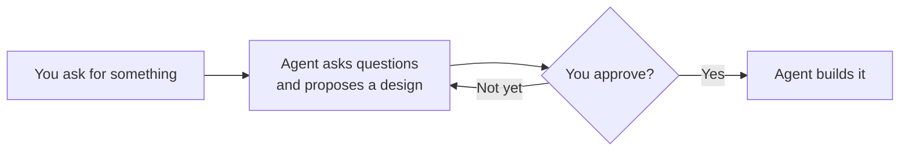

# Superbrainstorming

Talk through the design with your coding agent, agree on it, then let the agent build it.

Superbrainstorming is a plugin for Claude Code. When you ask your agent to build something, it asks you a few questions first, shows you a design, and waits for your OK. As soon as you approve, it starts building in the same session.



## Why?

Coding agents are good at building things. They can't know what you meant, who it's for, or which trade-offs you care about until someone asks, so a capable agent can still build the wrong thing, and build it well. Superbrainstorming has the agent check with you before it writes any code.

It's a fork of [Superpowers](https://github.com/obra/superpowers) by Jesse Vincent and Prime Radiant. Superpowers is a full workflow: brainstorm a design, write a detailed plan, then hand each task to a fresh subagent with test-driven development and code review at every step. That structure helped earlier models stay on track. Current models like Claude Opus 5.5, Sonnet 5.5 and Fable 5.1 can keep an agreed design in context and work through it on their own, so this fork keeps the brainstorming and drops the rest.

## How it works

First, the agent makes sure it understands what you're after: what you want to achieve, who it's for, and what "done" looks like. It writes that back to you so you can correct it.

Then it picks one of three paths based on the size of the job, and tells you which one so you can overrule it:

| Path | For | What happens |
|---|---|---|
| **Spike** | "Is this even possible?" questions | The agent suggests a quick experiment, you give it a nod, and it reports back what it found. Anything it builds is throwaway. |
| **Bounded** | Small, well-scoped changes to existing code | The agent asks what matters and shows you a short design in chat. |
| **Architectural** | New projects, new subsystems, big structural changes | The agent asks questions one at a time, suggests two or three approaches, and writes a spec to `docs/specs/`. |

Whichever path it takes, nothing gets built until you approve. Once you do, the agent gets started right away. It tracks its own steps, follows your project's conventions for tests and commits, and checks its work before calling it done. If it finds a problem with the design partway through, it stops and asks you instead of quietly changing course. When it's finished, you get a summary of what it built and how it checked it.

If you'd rather skip the design and just build, say so and the agent will.

## Install

In Claude Code, run:

```bash
/plugin marketplace add harrymunro/superbrainstorming
/plugin install superbrainstorming@superbrainstorming
```

Then start a new session.

> **Already using Superpowers?** Disable or uninstall it through `/plugin` first. Both plugins have a `brainstorming` skill and a session-start hook, and Superpowers' version moves on to writing a plan instead of building.

**Try it out:** in a fresh session, send `Let's make a react todo list`. The agent should load the `superbrainstorming:brainstorming` skill, say it's treating this as architectural work, and ask what the app is for before writing any code.

### Using another agent?

The skill is a standard `SKILL.md` in `skills/brainstorming/`, so any agent that supports Agent Skills can load it. Without the session-start hook it may not kick in on its own, so ask for it by name. Superpowers has integrations for many other tools if you want to port one.

## Visual companion

Some questions are easier to answer by looking, like layouts, mockups or diagrams. For those, the agent can offer to open a tab in your browser and show you options there. It's opt-in, needs Node.js, and runs entirely on your machine without loading anything from the internet. Mockups are saved in `.superbrainstorming/` in your project, so add that to your `.gitignore`.

## Superbrainstorming or Superpowers?

Pick **Superbrainstorming** if you're using a current frontier model and want a quick design check before the agent gets to work.

Pick **[Superpowers](https://github.com/obra/superpowers)** if you're using smaller or older models, or you want enforced TDD, per-task code review and git worktree management. Its extra structure is there for good reasons, and they still hold for models that need it.

<details>
<summary>Everything that changed from Superpowers</summary>

**Kept**
- The `brainstorming` skill: the three paths, the approval gate, one-question-at-a-time design, spec self-review and the visual companion.
- The Claude Code session-start hook.

**Changed**
- Approving the design (or, for architectural work, the written spec) starts the build. Upstream, it moved on to the `writing-plans` skill.
- The session-start note is short and plain. It replaces the `using-superpowers` skill, which relied on emphatic all-caps rules.
- Specs go to `docs/specs/` instead of `docs/superpowers/specs/`.
- The visual companion uses plain text branding and no longer loads the Prime Radiant logo, which upstream uses for usage telemetry.

**Removed**
- Skills: `writing-plans`, `executing-plans`, `subagent-driven-development`, `test-driven-development`, `systematic-debugging`, `verification-before-completion`, `requesting-code-review`, `receiving-code-review`, `using-git-worktrees`, `finishing-a-development-branch`, `dispatching-parallel-agents`, `writing-skills`, `diagnosing-superpowers` and `using-superpowers`.
- Integrations for tools other than Claude Code (Codex, Cursor, Gemini, OpenCode, Pi, Hermes, Kimi, Devin, Muse and others), along with their tests and packaging scripts.
- Upstream's design docs, release notes and community files.

</details>

## What's in this repo

- `skills/brainstorming/`: the skill and the optional visual companion.
- `hooks/`: a session-start hook that reminds the agent to brainstorm before building, and to build once you've approved the design.

## Contributing

Run the tests with:

```bash
# Visual companion server
cd tests/brainstorm-server && npm ci && npm test

# Session-start hook
bash tests/hooks/test-session-start.sh
```

Changes to `skills/brainstorming/SKILL.md` or `hooks/bootstrap.md` change how the agent behaves, so try them in real sessions before merging. [AGENTS.md](AGENTS.md) lists the checks to run.

## Credits

Superbrainstorming is built on [Superpowers](https://github.com/obra/superpowers), created by [Jesse Vincent](https://blog.fsck.com) and the team at [Prime Radiant](https://primeradiant.com). The brainstorming skill and visual companion are their work, and the full upstream git history is kept in this repo. Please report problems with this fork here, not upstream.

## License

MIT. See [LICENSE](LICENSE).
